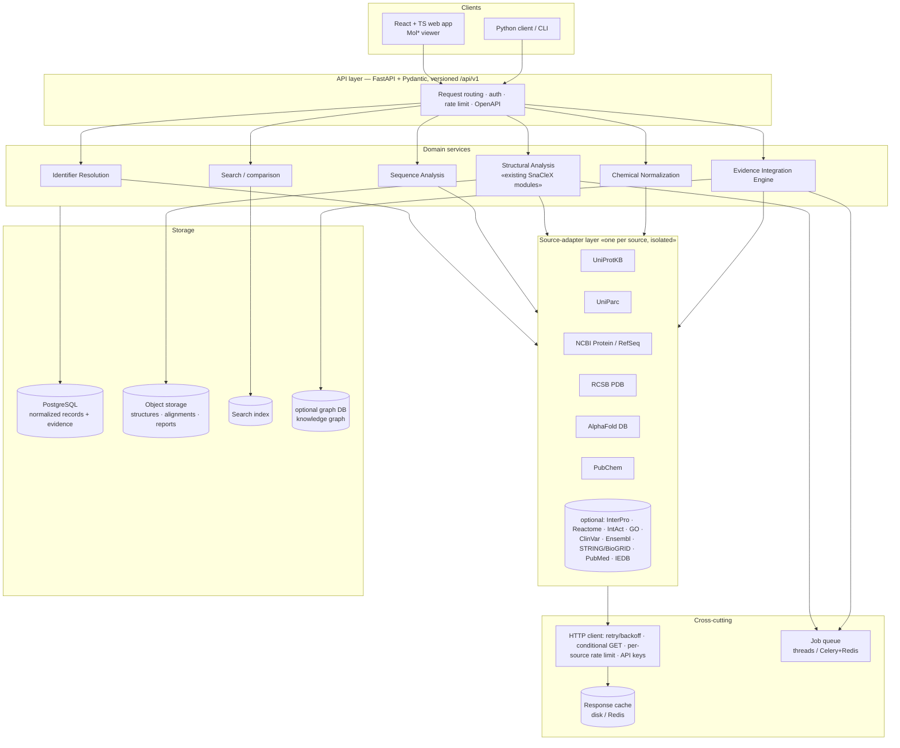
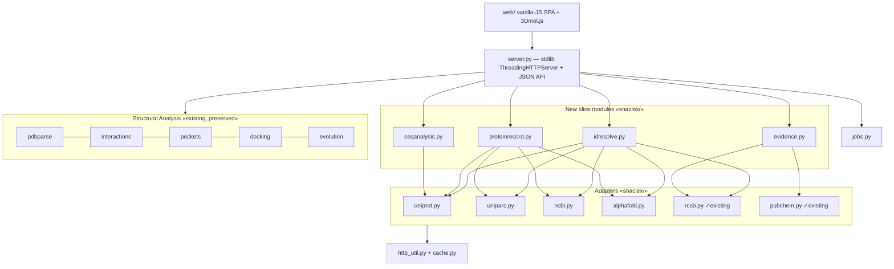
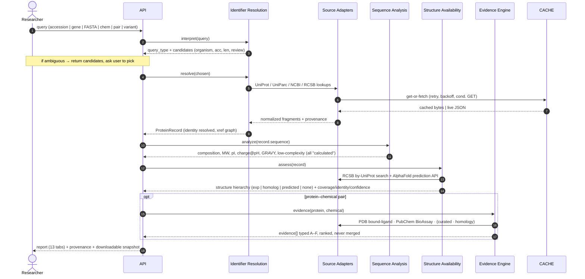
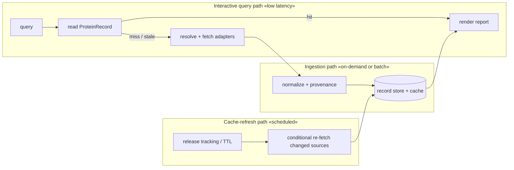

# 02 — System Architecture & Data Flow

Two views of the same system: the **target production architecture** (recommended
stack, the destination at scale) and the **vertical-slice architecture** (what
ships now, stdlib-first). They share the same layer boundaries so the slice
implementation can be swapped for the production one behind stable interfaces.

## 2.1 System architecture (target)

### Layer responsibilities

| Layer | Responsibility |
|---|---|
| **Source adapters** | One module per external source. Turn source-native JSON into normalized fragments with provenance. No cross-source logic. Independently testable, independently disableable. |
| **HTTP / infra** | Single choke point for retry, backoff, conditional requests, per-source rate limits, API-key injection, and caching. (Today: `snaclex/http_util.py` + `snaclex/cache.py`.) |
| **Identifier resolution** | Classify the query; build the cross-reference graph; decide protein identity; keep 1:N and N:N links. |
| **Sequence analysis** | Pure-compute sequence metrics + retrieved sequence features, merged into the record. |
| **Structural analysis** | The *existing* SnaCleX capability (`pdbparse`, `interactions`, `pockets`, `docking`, `evolution`) plus predicted-structure confidence handling. |
| **Chemical normalization** | Compound identity + PDB-ligand↔PubChem match-quality classification. |
| **Evidence integration** | Assemble the universal evidence objects, assign level A–F, rank, and forbid flattening. |
| **Storage** | Normalized records + evidence (relational), large binaries (object store), search index, optional graph. |
| **Jobs** | Docking, large alignments, batch, prediction — never inline in a request. |

## 2.2 Vertical-slice architecture (what ships now)

Same boundaries, stdlib implementations. No FastAPI, Postgres, Redis, or React;
everything runs from `python server.py` with an empty `requirements.txt`.

**Interface stability:** each slice module exposes a plain-function/plain-dict
API (no framework types). Moving to FastAPI later means wrapping these functions
in Pydantic response models and swapping `http_util`'s cache for Redis and
`jobs.py` for Celery — callers do not change.

## 2.3 Data-flow diagram — "resolve a query to a report"

## 2.4 Data-flow diagram — "ingestion vs interactive" (NFR-4)

Reports must not fan out live calls to every source on every open. Three
separate paths share the cache and record store:

- **Interactive** reads a materialized record; only a cold/stale miss triggers
  ingestion.
- **Ingestion** does the fan-out once, normalizes, stamps provenance, persists.
- **Refresh** watches source releases (UniProt release, PDB weekly, PubChem)
  and re-fetches only changed records with conditional requests.
