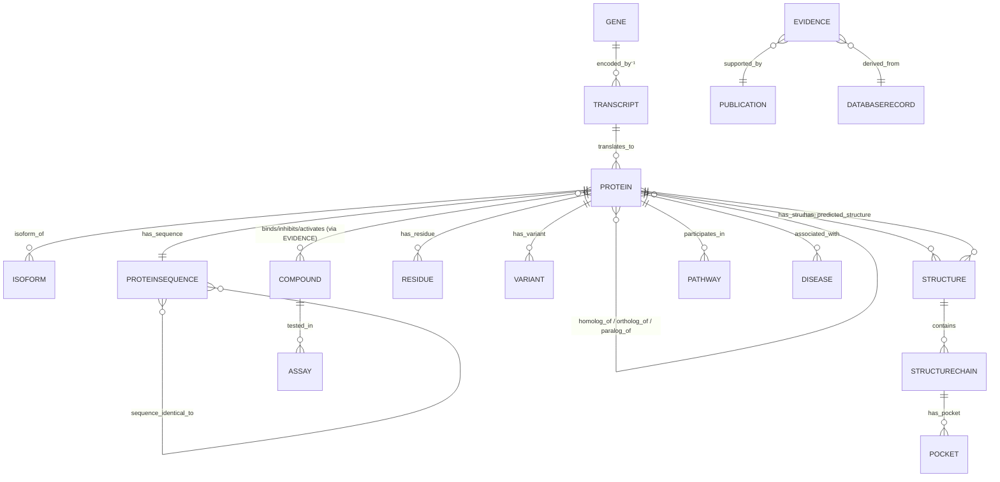

# 04 — Normalized Data Model

Three artifacts: the **Protein Record** (sequence-first aggregate), the
**Universal Evidence object**, and the **Knowledge Graph** node/edge schema. A
relational sketch (Postgres) follows. The slice ships these as plain dicts /
dataclasses (`snaclex/proteinrecord.py`, `snaclex/evidence.py`); the production
system materializes the same shapes as Pydantic + SQLAlchemy models.

## 4.0 Provenance envelope (used everywhere)

Every non-trivial value is wrapped so the UI can answer "why is this here?":

```jsonc
{
  "value": <any>,
  "source": "UniProtKB",                 // canonical source name
  "source_id": "P38398",                 // accession / record id at that source
  "source_version": "2026_03",           // release / entry version when known
  "retrieved_utc": "2026-07-10T12:00:00Z",
  "evidence_category": "curated",        // calculated | curated | homology | predicted | experimental
  "confidence": null,                     // 0..1 or source metric when applicable
  "limitations": "TrEMBL, unreviewed",   // free text, nullable
  "publications": ["PMID:1234567"]        // nullable
}
```

Fields that are cheap and self-evident (e.g. an accession string in a mapping)
may carry a shared provenance block at the section level instead of per value.

## 4.1 Protein Record

The central aggregate. Exists with **zero** structures. `canonical_id` is
internal and stable; it is *not* a gene symbol.

```jsonc
{
  "canonical_id": "SNX:PRT:9606:P38398:1",   // internal: taxon:acc:isoform-ordinal
  "preferred_name": "Breast cancer type 1 susceptibility protein",
  "gene": { "symbol": "BRCA1", "synonyms": ["RNF53","PPP1R53"], "ids": {"NCBIGene":"672","HGNC":"1100"} },
  "organism": { "scientific_name": "Homo sapiens", "taxon_id": 9606, "lineage": [...] },

  "accessions": {                            // identity, resolved — never merged on name
    "uniprot_primary": "P38398",
    "uniprot_secondary": ["..."],
    "uniparc": "UPI0000...",
    "ncbi_protein": ["NP_009225.1"],
    "refseq": ["NP_009225.1"],
    "pdb_entities": [{"pdb":"1JM7","entity":"1","chain":"A"}, ...],
    "alphafold": ["AF-P38398-F1"],
    "external": {"HGNC":"1100","Ensembl":"ENSP00000...","OMIM":"113705"}
  },

  "review_status": "reviewed",               // reviewed (Swiss-Prot) | unreviewed (TrEMBL) | ncbi-curated | ncbi-predicted
  "sequence": {
    "value": "MDLSALRVEE...",
    "length": 1863,
    "molecular_weight_Da": 207721,           // curated (UniProt) or calculated
    "checksum": { "crc64": "...", "md5": "...", "sha256": "..." },
    "is_canonical": true
  },
  "isoforms": [ { "id": "P38398-2", "name": "...", "sequence_ref": "...", "differences": [...] } ],
  "sequence_conflicts": [ { "position": 123, "from": "A", "to": "T", "source": "..." } ],

  "functional_annotations": [ { "type": "FUNCTION|CATALYTIC_ACTIVITY|COFACTOR|LOCALIZATION|TISSUE", "text": "...", "provenance": {...} } ],
  "domains_motifs": [ { "type": "domain|repeat|motif|region", "name": "BRCT", "start": 1646, "end": 1736, "source": "UniProt|InterPro", "provenance": {...} } ],
  "residue_annotations": [ { "kind": "active_site|binding_site|signal_peptide|transmembrane|coiled_coil|ptm", "start": .., "end": .., "description": "..", "provenance": {..} } ],
  "variants": [ { "position": 1775, "wt": "M", "mut": "R", "kind": "missense", "clinical": {...}|null, "sources": [...], "provenance": {..} } ],
  "ptms": [ { "position": .., "type": "phospho|glyco|..", "provenance": {..} } ],

  "structures": {                            // Stage-4 hierarchy, ordered
    "experimental": [ /* StructureRecord */ ],
    "homologous":   [ /* StructureRecord + %id */ ],
    "predicted":    [ /* PredictedStructureRecord */ ],
    "best_for_docking": "1JM7:A" | null
  },

  "chemical_evidence": [ /* EvidenceObject, levels A–F */ ],
  "protein_interactions": [ /* EvidenceObject, "interacts_with" */ ],
  "pathways": [ { "source": "Reactome", "id": "R-HSA-...", "name": "..", "provenance": {..} } ],
  "disease_associations": [ { "name": "..", "source": "UniProt|ClinVar", "review_status": "..", "provenance": {..} } ],
  "literature": [ { "pmid": "..", "title": "..", "provenance": {..} } ],

  "warnings": [ "unreviewed record", "no experimental structure", "isoform ambiguity" ],
  "provenance_summary": { "sources_used": [...], "retrieved_utc": "..", "tool_version": "SnaCleX vX" }
}
```

### StructureRecord (experimental or homologous)

```jsonc
{
  "kind": "experimental" | "homologous",
  "source": "RCSB",
  "pdb_id": "1JM7", "entity": "1", "chain": "A",
  "method": "X-RAY DIFFRACTION", "resolution_A": 1.85,
  "coverage": { "seq_start": 1646, "seq_end": 1863, "fraction": 0.12 },
  "sequence_identity_to_query": 1.0,        // <1.0 for homologs; drives Level-D transfer limits
  "chain_mapping": { "auth": "A", "label": "A", "uniprot_offset": 0 },
  "engineered_mutations": [ {"pos":.., "wt":"..","mut":".."} ],
  "missing_residues": [ [1..10], ... ],
  "oligomeric_state": "monomer",
  "bound_ligands": [ {"comp_id":"...","chain":"..","name":".."} ],
  "docking_suitable": true, "reasons": [ ".." ],
  "provenance": {..}
}
```

### PredictedStructureRecord (AlphaFold)

```jsonc
{
  "kind": "predicted", "source": "AlphaFold DB", "model_id": "AF-P38398-F1",
  "version": "v4", "created": "2022-..", "uniprot_start": 1, "uniprot_end": 1863,
  "coverage_fraction": 1.0, "fragmented": false,
  "global_plddt_mean": 71.4,                 // ⚠ VERIFY semantics
  "confidence_bands": { "very_high": 0.31, "confident": 0.28, "low": 0.22, "very_low": 0.19 },
  "low_confidence_regions": [ [1,120], [1500,1600] ],
  "pae_available": true, "pae_url": "..",
  "docking_suitable": false,                 // requires per-region confidence assessment first
  "docking_block_reason": "mean pLDDT < 70; requires prep assessment",
  "provenance": {..}
}
```

## 4.2 Universal Evidence object

The single shape behind every "X does Y to Z" claim. Levels never mix.

```jsonc
{
  "evidence_id": "SNX:EV:...",
  "subject": { "type": "protein", "ref": "SNX:PRT:9606:P38398:1" },
  "predicate": "binds|inhibits|activates|substrate_of|product_of|cofactor_of|interacts_with|associated_with",
  "object":  { "type": "compound", "ref": "PubChem:CID:5291" },

  "level": "A|B|C|D|E|F",                    // see 06-evidence-ranking.md
  "category": "experimental|biochemical|curated|homology|docking|ml",

  "source": "RCSB|PubChem BioAssay|..",
  "source_record": "PDB 1IEP chain A ligand STI | AID 12345",
  "experimental_method": "X-RAY | radioligand binding | ..",
  "assay_type": "IC50|Ki|Kd|EC50|%inhibition|..",
  "value": 13.0, "units": "nM", "relation": "=|<|>",   // never call docking score an affinity
  "outcome": "active|inactive|inconclusive",
  "species": "Homo sapiens",
  "protein_construct": "residues 242-493, T315 wild-type",
  "sequence_or_isoform": "P38398-1",
  "chemical_form": { "matched_as": "exact|parent|stereo|salt|substructure|name|unresolved", "cid": 5291, "inchikey": ".." },

  "publication": "PMID:..",
  "confidence": 0.0,                          // source metric or transfer-derived
  "curation_status": "curated|automatic|unreviewed",
  "computation": { "method": "AutoDock-style grid MC", "software": "SnaCleX vX", "params": {..}, "reproducibility": {"seed": 42} },
  "transfer": { "from_protein": "..", "sequence_identity": 0.62, "aligned_site_identity": 0.9, "limitations": ".." },  // Level D only
  "retrieved_utc": "..",
  "limitations": "docking score is a fit heuristic, not kcal/mol"
}
```

**Invariant (enforced by code + tests):** a `level == "E"` (docking) object may
never carry `assay_type` in {IC50,Ki,Kd,EC50} nor `units` in {nM,µM,M}; its
`value` is a fit score with `units: "score"`. A `level == "F"` object must carry
`category == "ml"` and a non-null `transfer`/`computation` explanation.

## 4.3 Knowledge graph

Provenance-aware property graph. Every **edge** carries the provenance envelope
plus evidence typing.

**Node types:** Protein · ProteinSequence · Isoform · Gene · Transcript ·
Organism · Structure · StructureChain · Pocket · Residue · Compound · Assay ·
Interaction · Pathway · Disease · Publication · DatabaseRecord.

**Edge types:** encoded_by · isoform_of · sequence_identical_to · homolog_of ·
ortholog_of · paralog_of · has_structure · has_predicted_structure ·
contains_domain · has_variant · binds · inhibits · activates · substrate_of ·
product_of · cofactor_of · interacts_with · participates_in · associated_with ·
supported_by · derived_from.

**Required edge attributes:** `source_database`, `source_id`, `evidence_type`,
`experimental_or_predicted`, `publication?`, `retrieved_utc`,
`confidence_or_quality`, `software_version?` (computed edges only).



## 4.4 Relational sketch (PostgreSQL, target)

Normalized core; `jsonb` for the flexible provenance/annotation payloads;
evidence in its own table so levels are never lost.

```sql
CREATE TABLE protein (
  canonical_id       text PRIMARY KEY,
  preferred_name     text,
  gene_symbol        text,
  taxon_id           integer NOT NULL,
  review_status      text NOT NULL,          -- reviewed|unreviewed|ncbi-curated|ncbi-predicted
  uniprot_primary    text,
  uniparc_upi        text,
  seq_crc64          text,                    -- identity key (with taxon+isoform)
  seq_length         integer,
  is_canonical       boolean DEFAULT true,
  data               jsonb NOT NULL,          -- full ProteinRecord snapshot
  retrieved_utc      timestamptz NOT NULL,
  tool_version       text NOT NULL
);
CREATE UNIQUE INDEX ux_protein_identity ON protein (taxon_id, uniprot_primary, seq_crc64);

CREATE TABLE protein_xref (                    -- 1:N and N:N mappings preserved
  protein_id  text REFERENCES protein(canonical_id),
  db          text NOT NULL,                  -- UniProt|UniParc|NCBI|RefSeq|PDB|AlphaFold|Gene|...
  ext_id      text NOT NULL,
  qualifier   text,                           -- entity/chain/isoform
  PRIMARY KEY (protein_id, db, ext_id, COALESCE(qualifier,''))
);

CREATE TABLE compound (
  cid         bigint PRIMARY KEY,
  inchikey    text, parent_cid bigint,
  formula     text, mol_weight double precision,
  data        jsonb NOT NULL, retrieved_utc timestamptz NOT NULL
);

CREATE TABLE structure (
  id text PRIMARY KEY,                         -- pdb:entity:chain | AF-...-F1
  protein_id text REFERENCES protein(canonical_id),
  kind text NOT NULL,                          -- experimental|homologous|predicted
  source text NOT NULL, method text, resolution_a double precision,
  seq_identity double precision, coverage_fraction double precision,
  confidence jsonb, data jsonb NOT NULL, retrieved_utc timestamptz NOT NULL
);

CREATE TABLE evidence (
  evidence_id text PRIMARY KEY,
  subject_ref text NOT NULL, predicate text NOT NULL, object_ref text NOT NULL,
  level char(1) NOT NULL CHECK (level IN ('A','B','C','D','E','F')),
  category text NOT NULL,
  source text NOT NULL, source_record text,
  assay_type text, value double precision, units text, relation text, outcome text,
  species text, sequence_or_isoform text, chemical_form jsonb,
  publication text, confidence double precision, curation_status text,
  computation jsonb, transfer jsonb, limitations text, retrieved_utc timestamptz NOT NULL
);
CREATE INDEX ix_evidence_pair ON evidence (subject_ref, object_ref, level);
-- Guard: docking never stored as an affinity unit.
ALTER TABLE evidence ADD CONSTRAINT ck_docking_not_affinity
  CHECK (NOT (level='E' AND units IN ('nM','uM','M','pM')));
```

Object storage holds structure files, alignments, and generated report snapshots
keyed by content hash (checksums per NFR-1). The optional graph DB is populated
from `evidence` + `protein_xref` for exploration; it is a projection, not the
source of truth.
