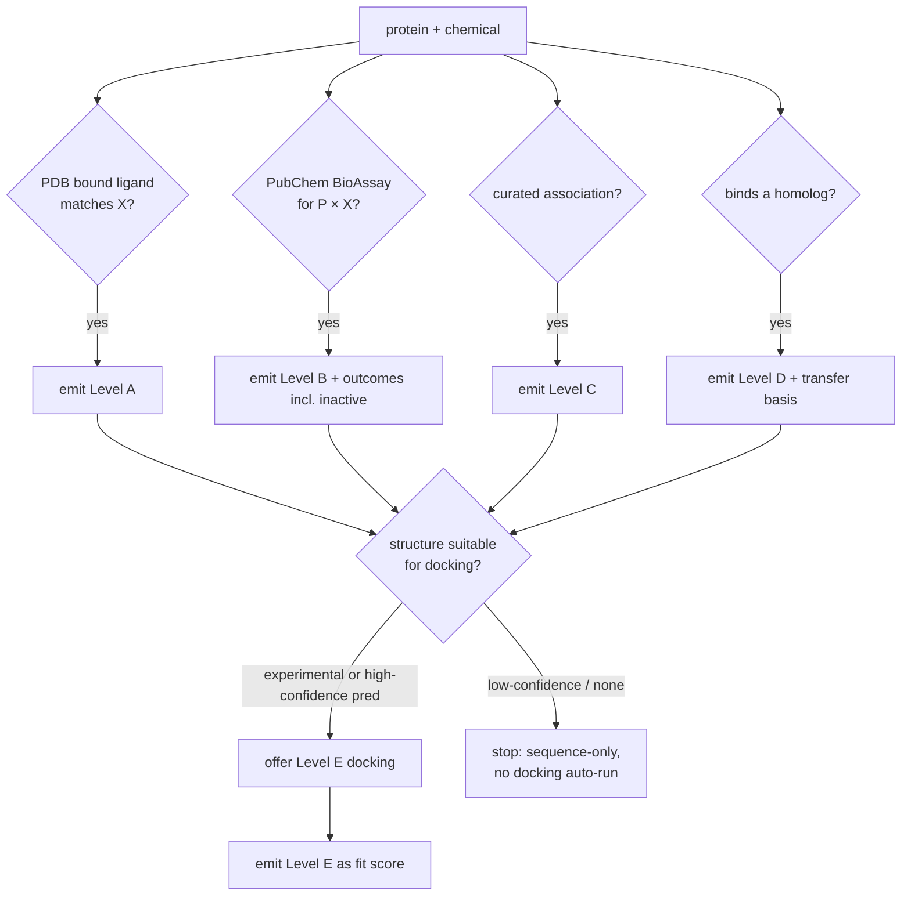

# 06 — Evidence-Ranking Specification (Levels A–F)

The scientific heart of the platform. For any protein–chemical (or
protein–protein) claim, evidence is assigned exactly **one** of six levels and
**never** flattened into an undifferentiated "interaction". Implemented as
`snaclex/evidence.py`.

## 6.1 The six levels

| Level | Name | What it is | Strength | Never say |
|---|---|---|---|---|
| **A** | Direct experimental structural | The chemical (or a close chemical form) is bound to *the requested protein* in an experimental PDB structure | Strongest — atoms observed | — |
| **B** | Direct biochemical / cellular | A curated assay (PubChem BioAssay, ChEMBL-style) directly measures the compound against *this protein* | Strong — measured | — |
| **C** | Curated database association | A trusted source states the compound is an inhibitor/substrate/cofactor/drug/metabolite of this protein (no attached measurement) | Moderate | "measured" |
| **D** | Homology-transferred | The compound binds a **homolog/ortholog/paralog/related domain**, transferred by sequence/site identity | Inference | "binds this protein" |
| **E** | Computational docking | A pose from docking into an experimental or reliable predicted structure | Hypothesis | "affinity", "kcal/mol", "validated" |
| **F** | ML / similarity prediction | Ligand-similarity, target prediction, embeddings, chemogenomics | Weakest inference | "proof", "binding" |

**Ordering for display:** A > B > C > D > E > F. This orders *directness of
evidence*, not certainty of biology — a high-affinity Level-B Ki can matter more
than a Level-A fragment soak; both are shown with their values.

## 6.2 Assignment rules (deterministic)

Given the gathered raw evidence for `(protein P, compound X)`:

```
for each raw item:
    if item.source == PDB and item.bound_to == P and chem_form_matches(item.ligand, X):
        level = A                       # exact | parent | stereo | salt variant all qualify, form recorded
    elif item.source in {PubChem BioAssay, curated assay} and item.target == P and item.has_value:
        level = B
    elif item.source in curated_association_sources and item.target == P:
        level = C
    elif item.bound_to == homolog(P) or item.target == homolog(P):
        level = D                       # requires transfer{from, seq_identity, site_identity}
    elif item.source == docking_engine:
        level = E                       # requires computation{software, params, seed}
    else:
        level = F                       # requires computation/transfer explanation
```

`chem_form_matches` uses the chemical-normalization classifier (Stage 7): exact
InChIKey, parent CID, stereo, salt/protonation variant, or substructure — the
**match quality is recorded on the evidence** (`chemical_form.matched_as`) and
never silently upgraded (a salt is not the parent).

## 6.3 Required fields per level (validation-enforced)

| Field | A | B | C | D | E | F |
|---|---|---|---|---|---|---|
| `source_record` (PDB/AID/…) | ✔ | ✔ | ✔ | ✔ | ✔ | ✔ |
| `chemical_form.matched_as` | ✔ | ✔ | ✔ | ✔ | ✔ | ✔ |
| `assay_type` + `value` + `units` + `relation` | – | ✔ | – | if present | **score only** | – |
| `outcome` (active/inactive/inconclusive) | – | ✔ | – | – | – | – |
| `species` + `protein_construct` | ✔ | ✔ | rec. | ✔ | ✔ | – |
| `transfer{from, sequence_identity, aligned_site_identity, limitations}` | – | – | – | **✔** | – | opt. |
| `computation{software, params, reproducibility}` | – | – | – | – | **✔** | **✔** |
| `publication` | rec. | rec. | rec. | rec. | – | – |

## 6.4 Hard invariants (unit-tested)

1. **Docking is not affinity.** Level E `units` must be `"score"`; it may never be
   `nM/µM/pM/M`, and `assay_type` may never be `Ki/Kd/IC50/EC50`. A docking score
   is described as "predicted fit (lower = better), not a binding energy".
2. **Association is not binding.** Level C/F copy may not contain "binds",
   "inhibits with", or any measured phrasing unless a value field is present.
3. **Homology transfer shows its basis.** Level D must carry `transfer` with
   `sequence_identity` and, where a binding site is defined,
   `aligned_site_identity`; the UI shows both and the source protein.
4. **No level collapsing.** The evidence list returned for a pair preserves each
   item at its own level; there is no single "interaction: yes/no" field. A
   summary count is `{A:n, B:n, C:n, D:n, E:n, F:n}`, never a boolean.
5. **Negatives are kept.** Level-B `outcome == "inactive"` items are retained and
   displayed (NFR-5) — an inactive assay is evidence too.
6. **Construct/isoform context preserved.** `sequence_or_isoform` and
   `protein_construct` travel with B/A/D so a T315I-mutant assay is not read as
   wild-type.

## 6.5 Gathering order & the docking gate (Stage 6 → Stage 4/5)

Evidence is gathered **before** any docking is offered:



**Docking gate (never auto-dock a weak model):** Level E is only *offered* when
Stage 4 marks a structure `docking_suitable` — an experimental structure, or a
predicted model whose target region passes a confidence + preparation assessment.
A low-confidence AlphaFold region returns "sequence-only; docking not run",
matching the existing tool's research-only stance.

## 6.6 Presentation contract

- Each level renders in its **own card** with a distinct badge/color; levels are
  never summed into one score.
- The overview shows **"N direct (A/B) vs M predicted (D/E/F)"** as separate
  counts (PRD overview requirement).
- Weak-evidence, low-confidence-model, and homology-transfer states raise the
  overview **warning banner**.
- Every card links to its evidence object (Provenance tab) so a researcher can
  inspect exactly why the claim was made.
