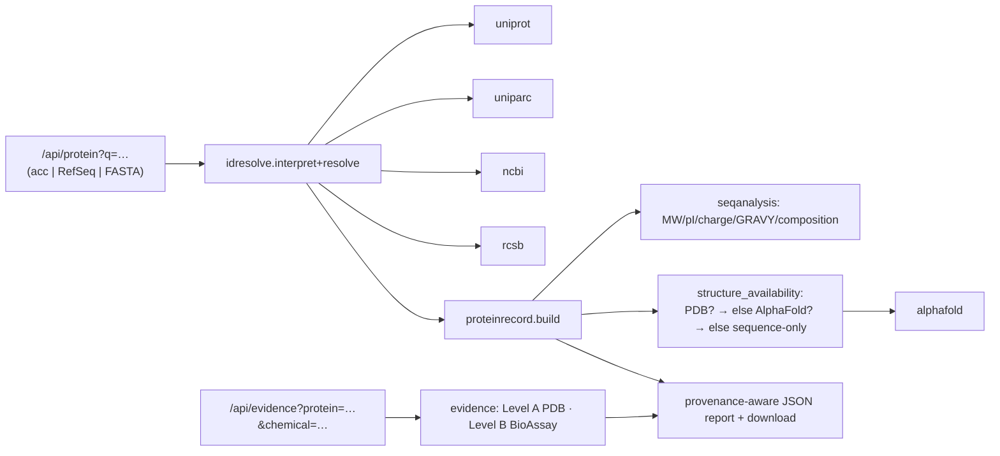

# 10 — Phased Implementation Plan

Maps the task's four phases onto the codebase, states what the **vertical slice
shipped in this change**, and what is scaffolded vs deferred. Guiding rule from
the task: *do not generate a large amount of disconnected code* — so only Phase 1
has a working slice; Phases 2–4 are specified, not built.

## Phase 1 — Unified protein record  *(vertical slice — partially shipped now)*

| Item | Status | Where |
|---|---|---|
| UniProtKB adapter | 🟢 shipped | `snaclex/uniprot.py` |
| UniParc adapter | 🟢 shipped | `snaclex/uniparc.py` |
| NCBI Protein/RefSeq adapter | 🟢 shipped | `snaclex/ncbi.py` |
| RCSB PDB | 🟢 existing + extended (by-UniProt availability) | `snaclex/rcsb.py` |
| PubChem | 🟢 existing + BioAssay/normalize | `snaclex/pubchem.py` |
| Identifier normalization (Stage 1/2) | 🟢 shipped | `snaclex/idresolve.py` |
| Sequence-first ProteinRecord | 🟢 shipped | `snaclex/proteinrecord.py` |
| Sequence-only analysis (Stage 3) | 🟢 shipped | `snaclex/seqanalysis.py` |
| Structure availability (Stage 4) | 🟢 shipped | `proteinrecord.structure_availability` |
| Direct PDB ligand mapping (Level A) | 🟢 shipped | `snaclex/evidence.py` |
| Basic PubChem BioAssay evidence (Level B) | 🟢 shipped | `snaclex/evidence.py` + `pubchem.bioassay_summary` |
| AlphaFold model retrieval | 🟢 shipped | `snaclex/alphafold.py` |
| Report endpoints | 🟢 shipped | `server.py` new routes; `apidocs.py` |
| Report UI (13 tabs) | 🟡 API-complete, minimal UI | `web/` (Phase 1.5) |

## Phase 2 — Predicted structures & functional annotation  *(in progress)*

| Item | Status | Where |
|---|---|---|
| AlphaFold confidence-aware handling (real per-residue pLDDT → bands, low-confidence/disordered regions, docking gate) | 🟢 shipped | `alphafold.build_confidence`; `GET /api/model_confidence` |
| InterPro domains adapter (optional, env-gated, provenance-stamped) | 🟢 shipped | `interpro.py`; `GET /api/domains` |
| Conservation (Pfam) reuse | 🟢 existing | `evolution.py`; `GET /api/evolution` |
| PAE ingestion (image/doc URL surfaced; numeric PAE parse) | 🟡 URLs surfaced; numeric parse pending | `alphafold.parse_prediction` |
| Homology-based structure selection (RCSB sequence search → homologous tier) | 🟢 shipped | `homology.py`; `rcsb.sequence_search`; `GET /api/homologs`; `?homologs=1` |
| Level D transfer surfacing (homolog candidates, no over-claim) | 🟢 shipped | `evidence.level_d_transfer`; `/api/evidence?...&homologs=1` |
| Predicted-pocket analysis **with warnings** (run `pockets.py` on AF models, confidence-annotated) | 🔲 specified | reuse `pockets.py` |

Stage-4 hierarchy now honors the task's ordering: **experimental → homologous
experimental → predicted → sequence-only**. A homolog is only offered as a
docking receptor above a sequence-identity floor (≥0.40) and always with a "not
the requested protein" caveat; Level-D evidence surfaces homolog *candidates*
without asserting a "binds" claim until a per-entry ligand match confirms it.

The confidence gate deliberately keeps model download **out** of the lightweight
`structure_availability` path (NFR-4); `/api/model_confidence` fetches the model
coordinates on demand and drives the docking gate from measured pLDDT, so a
low-confidence model is never marked dockable.

## Phase 3 — Research workspaces  *(started)*

| Item | Status | Where |
|---|---|---|
| Genetics/variant analysis: parse `BRAF V600E` / `TP53 R175H` / HGVS → residue mapping (sequence coords) with **WT-residue validation**, coding consequence, domain disruption, curated-annotation overlap, known-variant match | 🟢 shipped | `variants.py`; `GET /api/variant` |
| Clinical interpretation shown **with evidence + review status + limitations** (never a clinical call) | 🟢 shipped | `variants.analyze` |
| Structure-coordinate mapping (per-PDB author numbering via SIFTS / Sequence Coordinates) | 🟡 canonical coord + structure list; SIFTS mapping pending | — |
| Immunology / Oncology lenses over the same record + evidence model | 🔲 specified | — |
| Pathway (Reactome), PPI (IntAct/STRING/BioGRID), ClinVar, Ensembl/VEP, PubMed adapters — optional, env-gated, license-checked | 🔲 specified | — |

The variant path deliberately makes **no** clinical claim: it maps the residue,
validates the WT against the canonical sequence (catching wrong-isoform /
off-by-one numbering), classifies the protein-level consequence, and surfaces any
curated interpretation *with its source and the record's review status*.
Frameshift/splice/start-loss/stop-loss and population frequency are flagged as
needing transcript-level (Ensembl/VEP) and authorized (ClinVar) sources.

## Phase 4 — Advanced computation

- Batch analysis, family/ortholog/WT-vs-mutant comparison, variant structural
  analysis, chemical similarity & target comparison, optional Vina/GNINA docking
  and optional on-demand prediction (ESMFold/ColabFold), knowledge-graph
  exploration. All async, all opt-in.

## Vertical slice — what shipped (the required demonstration)

The task's minimal slice must show input→resolve→structure-availability→
AlphaFold-fallback→sequence-only→PubChem→evidence-separation→provenance-report.
Shipped as **stdlib code + offline tests**:

Demonstrated behaviors:
- **UniProt / RefSeq / raw FASTA** all enter and resolve (checksum bridge for
  FASTA).
- Resolution spans **UniProtKB + UniParc + NCBI + RCSB**.
- **Experimental structure availability** detected via RCSB by-UniProt search.
- **AlphaFold model retrieved** when no PDB structure exists.
- **Sequence-only analysis** always available (no structure required).
- **PubChem chemical lookup** (existing) integrated.
- **Evidence separation**: Level A (PDB bound ligand) vs Level E (docking) never
  merged; docking stays a fit score.
- **Provenance-aware downloadable report** via the report endpoint + export.

### What the slice deliberately does *not* do
- No Postgres/Redis/Celery/React (target-stack, Phase 4 infra).
- No live InterPro/Reactome/ClinVar/PubMed (Phase 3, license-gated).
- No auto-docking against predicted models (gated by design).
- C/D/F evidence gathering is scaffolded with explicit "not yet gathered"
  markers rather than fabricated results.

## Testing gate per phase

Every phase lands with offline `unittest` coverage of its pure-compute and parse
helpers (existing convention), plus an in-process server integration test for
new endpoints. No phase merges without the suite green on Python 3.11–3.13 in CI.
