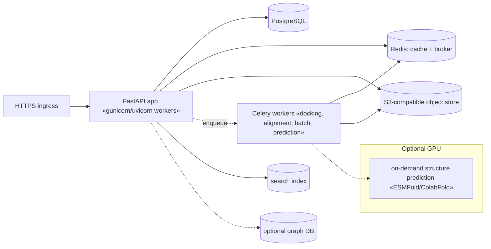

# 12 — Deployment

Two deployment stories, matching the two architectures.

## 12.1 Vertical slice (ships now — zero dependency)

Unchanged from today's SnaCleX: one stdlib process, no build step.

```bash
python server.py                 # http://127.0.0.1:8010
python server.py --port 8000
```

- **Requirements:** Python 3.11–3.13; outbound HTTPS to UniProt, UniParc, NCBI,
  RCSB, AlphaFold, PubChem. No pip installs (`requirements.txt` empty by design).
- **PaaS:** reads `$PORT`, binds `0.0.0.0` when set. Render / Railway / Fly / Heroku
  via the existing `Procfile` (`web: python server.py`) and `render.yaml`.
- **Config (env):**
  | Var | Effect |
  |---|---|
  | `SNACLEX_HTTP_CACHE` | dir → enable disk cache for upstream GETs |
  | `SNACLEX_HTTP_CACHE_TTL` | cache TTL seconds (default 86400) |
  | `NCBI_API_KEY` | raise NCBI E-utilities rate 3→10 req/s |
  | `SNACLEX_IP_SALT` | pin the log IP-hash salt |
  | `SNACLEX_ENABLE_*` | (future) gate optional enrichment adapters |
- **Tests / CI:** `python -m unittest discover -s tests -v`; CI byte-compiles and
  runs the offline suite on 3.11–3.13 (`.github/workflows/ci.yml`).
- **Free-tier caveat:** instances sleep when idle; first request may take ~30 s.

## 12.2 Target production (heavyweight track — containerized)

Adopt only when the scale justifies it; each piece is opt-in.



- **Compose / K8s:** `docker-compose.yml` for dev (api, worker, postgres, redis,
  minio); Helm/manifests for prod. API and workers share the image, differ by
  entrypoint.
- **Migrations:** Alembic; `alembic upgrade head` on deploy.
- **Config:** 12-factor env; secrets via the platform's secret store (never in
  the image). Per-source API keys (NCBI, BioGRID, …) injected at runtime.
- **Observability:** structured request/error logs already present in `server.py`;
  add OpenTelemetry traces + Sentry in the FastAPI app (opt-in).
- **Data engineering:** ingestion + cache-refresh run as scheduled Celery beats,
  separate from the interactive API (NFR-4); database-release tracking triggers
  incremental refresh; downloaded files verified by checksum and content-addressed
  in object storage; long jobs are resumable via job records.
- **Scaling:** API and workers scale horizontally; Postgres read replicas for
  heavy report reads; Redis for hot cache; GPU node pool only for optional
  prediction.

## 12.3 Promotion path (slice → target)

1. Wrap the slice service functions (`idresolve`, `proteinrecord`, `seqanalysis`,
   `evidence`) in FastAPI routers + Pydantic models — signatures already match.
2. Point `http_util`'s cache at Redis; move `jobs.py` submit/status behind Celery.
3. Persist `ProteinRecord`/`evidence` to Postgres via the schema in
   [04](04-data-model.md); object-store the structure files/reports.
4. Keep the stdlib server as the "lite" deployment target — the interfaces don't
   diverge.
